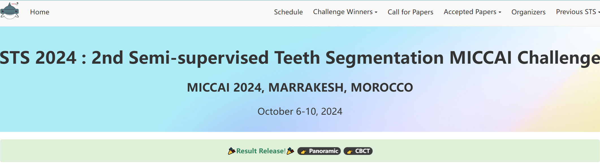
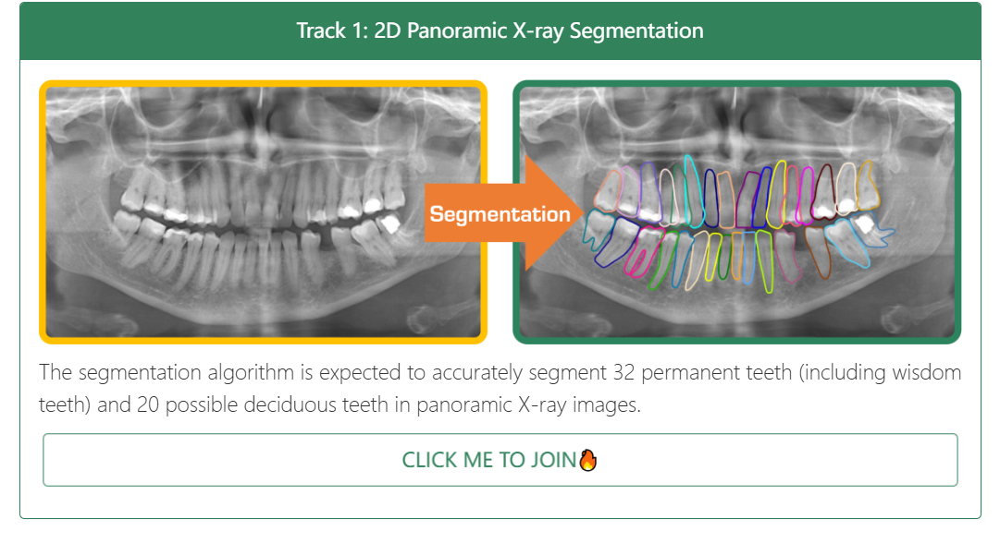
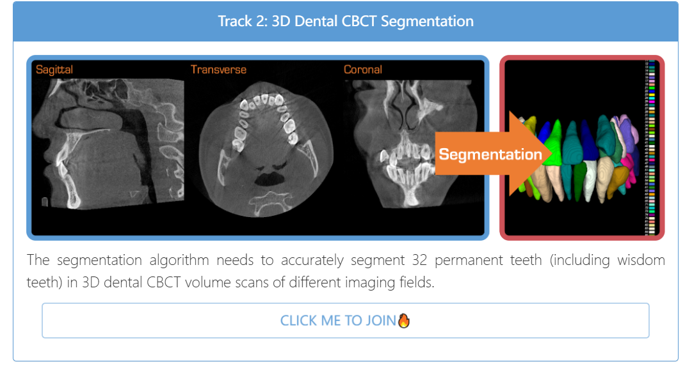
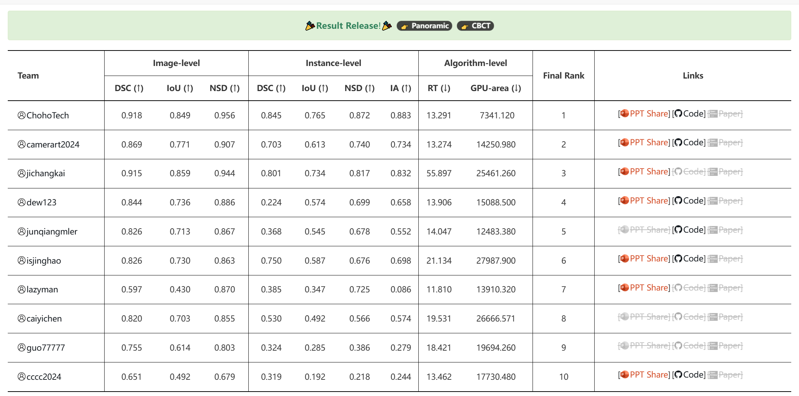
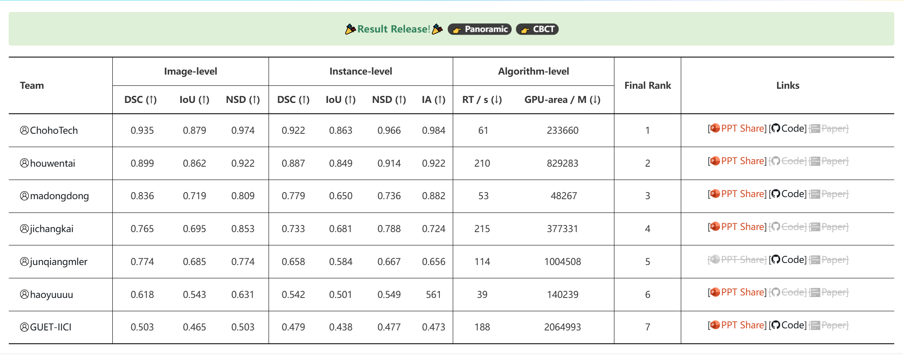

# 🦷 STS 2024: 2nd Semi-supervised Teeth Segmentation MICCAI Challenge  
**MICCAI 2024, Marrakesh, Morocco | October 6-10, 2024**  

[Challenge Main Website](https://sts-challenge.github.io/miccai2024/index.html)

---

## 📌 Introduction  
The **STS 2024 Challenge** focuses on advancing semi-supervised learning for tooth segmentation in dental imaging. We extend the 2023 challenge to multi-instance and multi-class settings, emphasizing instance-level segmentation. This year features two tracks:  
- **2D Panoramic X-ray Segmentation**  
- **3D Dental CBCT Segmentation**  

Our goal is to address the limitations of labeled data in dental imaging while balancing segmentation accuracy, inference speed, and GPU resource efficiency.  



---

> ## 🗓️ Important Dates (PST)
>
> | Registration Open                 | July 15      |
> | --------------------------------- | ------------ |
> | Challenge Validation Deadline     | September 15 |
> | Challenge Final Deadline          | September 20 |
> | Announcement of Challenge Winners | October 6-10 |
> | Workshop Date                     | October 6-10 |

---

## 📊 Evaluation Metrics  
Results are evaluated using a **multi-metric framework** to balance accuracy and efficiency:  
- **Region error**: Dice Similarity Coefficient (DSC), Intersection over Union (IoU)  
- **Boundary error**: Normalized Surface Dice (NSD)  
- **Instance-level detection**: Identification Accuracy (IA)  
  - IA = `#{D ∩ G} / #{D ∪ G}` (via Mask IoU ≥ 0.5 matching)  
- **Efficiency**: Running Time (RT), GPU Memory-Time Area (GPU-area)  

For implementation details, visit our [evaluation code repository](https://github.com/STS-challenge/STS).   

---

## 📈 Ranking Scheme  
1. Compute **image-level metrics** (DSC, IoU, NSD)  
2. Calculate **instance-level metrics** (DSC, IoU, NSD, IA) via greedy matching  
3. Measure **RT and GPU-area** (final testing phase only)  
4. Rank teams separately by each of the 9 metrics  
5. Final rank = average of 9 ranks (ties allowed)  

---

## 🏆 Challenge Awards  
- **Cash Prize**: $500 for 1st place  
- **Certificates**: Top 10 teams  
- **Oral Presentation**: Invitations for top performers  
- **Paper Publication**: Workshop paper opportunities for outstanding teams  

---

## 🏁 Tracks  

### Track 1: 2D Panoramic X-ray Segmentation  
**Goal**: Segment 32 permanent teeth (including wisdom teeth) and 20 deciduous teeth.  


**Join here**: [CodaBench Competition](https://www.codabench.org/competitions/3024/#/pages-tab)   

### Track 2: 3D Dental CBCT Segmentation  
**Goal**: Segment 32 permanent teeth in 3D CBCT scans.  


**Join here**: [CodaBench Competition](https://www.codabench.org/competitions/3025/#/pages-tab)   

---

## 🏅 Final Results  and Reproducible Code
### Panoramic X-ray Track  



| Final Rank | 指标\队伍名称 | Methods                                                      | GitHub                                                       | Dice_instance | Dice_image | NSD_instance | NSD_image | mIoU_instance | mIoU_image | Identification Accuracy | Time   | GPU_Consumption |
| ---------- | ------------- | ------------------------------------------------------------ | ------------------------------------------------------------ | ------------- | ---------- | ------------ | --------- | ------------- | ---------- | ----------------------- | ------ | --------------- |
| 1          | ChohoTech     | [](https://github.com/wuchengyu123/MICCAI_STS2024/tree/main/2d/1_choho_tech.pdf) | [](https://github.com/fenglian425/STS2D) | 0.845         | 0.918      | 0.872        | 0.956     | 0.765         | 0.849      | 0.883                   | 13.291 | 7341.120        |
| 2          | camerart2024  | [](https://github.com/wuchengyu123/MICCAI_STS2024/tree/main/2d/2_camerart.pdf) | [](https://github.com/Liaaaar/2024-MICCAI-STS-2D) | 0.703         | 0.869      | 0.740        | 0.907     | 0.613         | 0.771      | 0.734                   | 13.274 | 14250.980       |
| 3          | jichangkai    | [](https://github.com/wuchengyu123/MICCAI_STS2024/tree/main/2d/3_jichangkai.pdf) | [](https://github.com/wuchengyu123/MICCAI_STS2024/tree/main/2d/1_choho_tech.pdf) | 0.801         | 0.915      | 0.817        | 0.944     | 0.734         | 0.859      | 0.832                   | 55.897 | 25461.260       |
| 4          | dew123        | [](https://github.com/wuchengyu123/MICCAI_STS2024/tree/main/2d/4.pptx) | [](https://github.com/Dew026/DICL) | 0.224         | 0.844      | 0.699        | 0.886     | 0.574         | 0.736      | 0.658                   | 13.906 | 15088.500       |
| 5          | junqiangmler  | [](https://github.com/wuchengyu123/MICCAI_STS2024/tree/main/2d/2_camerart.pdf) | [](https://github.com/junqiangchen/STS2024) | 0.368         | 0.826      | 0.678        | 0.867     | 0.545         | 0.713      | 0.552                   | 14.047 | 12483.380       |
| 6          | isjinghao     | [](https://github.com/wuchengyu123/MICCAI_STS2024/tree/main/2d/6.pdf) | [](https://github.com/jcwang123) | 0.750         | 0.826      | 0.676        | 0.863     | 0.587         | 0.730      | 0.698                   | 21.134 | 27987.900       |
| 7          | lazyman       | [](https://github.com/wuchengyu123/MICCAI_STS2024/tree/main/2d/7.pdf) | [](https://github.com/aicorein/STS2024-Semi-Supervised-Cross-Teaching) | 0.385         | 0.597      | 0.725        | 0.870     | 0.347         | 0.430      | 0.086                   | 11.810 | 13910.320       |
| 8          | caiyichen     | [](https://github.com/wuchengyu123/MICCAI_STS2024/tree/main/2d/2_camerart.pdf) | [](https://github.com/wuchengyu123/MICCAI_STS2024/tree/main/2d/1_choho_tech.pdf) | 0.530         | 0.820      | 0.566        | 0.855     | 0.492         | 0.703      | 0.574                   | 19.531 | 26666.571       |
| 9          | guo77777      | [](https://github.com/wuchengyu123/MICCAI_STS2024/tree/main/2d/2_camerart.pdf) | [](https://github.com/wuchengyu123/MICCAI_STS2024/tree/main/2d/1_choho_tech.pdf) | 0.324         | 0.755      | 0.386        | 0.803     | 0.285         | 0.614      | 0.279                   | 18.421 | 19694.260       |
| 10         | cccc2024      | [](https://github.com/wuchengyu123/MICCAI_STS2024/tree/main/2d/10.pptx) | [](https://github.com/SUTAN-01/MICCAI-STS-2024) | 0.319         | 0.651      | 0.218        | 0.679     | 0.192         | 0.492      | 0.244                   | 13.462 | 17730.480       |

### CBCT Track  



| Final Rank | 指标\参赛队伍 | Methods                                                      | GitHub                                                       | Dice_instance | Dice_image | NSD_instance | NSD_image | mIoU_instance | mIoU_image | Identification Accuracy | Time | GPU_Consumption | AVG   |
| ---------- | ------------- | ------------------------------------------------------------ | ------------------------------------------------------------ | ------------- | ---------- | ------------ | --------- | ------------- | ---------- | ----------------------- | ---- | --------------- | ----- |
| 1          | ChohoTech     | [](https://github.com/wuchengyu123/MICCAI_STS2024/tree/main/3d/1.pdf) | [](https://github.com/fenglian425/STS3D) | 0.922         | 0.935      | 0.966        | 0.974     | 0.863         | 0.879      | 0.984                   | 61   | 233660          | 1.444 |
| 2          | houwentai     | [](https://github.com/wuchengyu123/MICCAI_STS2024/tree/main/3d/2.pdf) | [](https://github.com/jcwang123) | 0.887         | 0.899      | 0.914        | 0.922     | 0.849         | 0.862      | 0.922                   | 210  | 829283          | 2.778 |
| 3          | madongdong    | [](https://github.com/wuchengyu123/MICCAI_STS2024/tree/main/3d/3.pdf) | [](https://github.com/kioic/STS_2024.git) | 0.779         | 0.836      | 0.736        | 0.809     | 0.650         | 0.719      | 0.882                   | 53   | 48267           | 3.000 |
| 4          | jichangkai    | [](https://github.com/wuchengyu123/MICCAI_STS2024/tree/main/3d/4.pdf) | [](https://www.codabench.org/competitions/3025/) | 0.733         | 0.765      | 0.788        | 0.853     | 0.681         | 0.695      | 0.724                   | 215  | 377331          | 4.111 |
| 5          | junqiangmler  | [](https://github.com/wuchengyu123/MICCAI_STS2024/tree/main/3d/5.docx) | [](https://github.com/junqiangchen/STS2024) | 0.658         | 0.774      | 0.667        | 0.774     | 0.584         | 0.685      | 0.656                   | 114  | 1004508         | 4.889 |
| 6          | haoyuuuu      | [](https://github.com/wuchengyu123/MICCAI_STS2024/tree/main/3d/6.pdf) | [](https://www.codabench.org/competitions/3025/) | 0.542         | 0.618      | 0.549        | 0.631     | 0.501         | 0.543      | 0.561                   | 39   | 140239          | 5.000 |
| 7          | GUET-IICI     | [](https://github.com/wuchengyu123/MICCAI_STS2024/tree/main/3d/7.pptx) | [](https://github.com/magic-fortune/MICCAI2024) | 0.479         | 0.503      | 0.477        | 0.503     | 0.438         | 0.465      | 0.473                   | 188  | 2064993         | 6.778 |

---

## 📁 Repository Structure  
```
STS2024-Challenge/  
├── README.md                                  # This file  
├── assets/                                    # Store competition images here  
│   ├── image-20250613132918804.png           # 2D track segmentation example
│   ├── image-20250613132935913.png           # 3D track segmentation example
│   ├── image-20250613133002565.png           # 2D track winners visualization
│   ├── image-20250613133020574.png           # 3D track winners visualization
│   └── image-20250613133108457.png           # Overall challenge overview
├── ranking/                                   # Final ranking results
│   ├── [STS challenge Final rank-2D赛道.csv](./ranking/STS%20challenge%20Final%20rank-2D%E8%B5%9B%E9%81%93.csv)  # 2D track final rankings
│   └── [STS challenge Final rank-3D赛道.csv](./ranking/STS%20challenge%20Final%20rank-3D%E8%B5%9B%E9%81%93.csv)  # 3D track final rankings
├── DockerFromParticipants/                    # Participant submissions container
│   └── docker.txt                            # Link to participant Docker submissions
├── ppt/                                      # Presentation materials
│   ├── 2d/                                   # 2D track presentations
│   │   ├── 1 choho tech.zip
│   │   ├── 2 camerart.pptx
│   │   ├── 3 jichangkai.pptx
│   │   ├── 4 dew123.pptx
│   │   ├── 5 junqiangmler.docx
│   │   ├── 6 isjinghao.pptx
│   │   ├── 7 lazyman.pptx
│   │   ├── 8 caiyichen.pptx
│   │   ├── 9 guo77777.pptx
│   │   └── 10 cccc2024 .pptx
│   └── 3d/                                   # 3D track presentations
│       ├── 1 chohotech.zip
│       ├── 2 houwentai.zip
│       ├── 3 madongdong.pptx
│       ├── 4 jichangkai.pptx
│       ├── 5 junqiangmler.docx
│       ├── 6 haoyuuuu.pdf
│       └── 7 gute_iici.pptx
├── TechnicalReport/                          # Technical reports
│   ├── 2d/                                   # 2D track technical reports
│   │   ├── 1 chohotech.pdf
│   │   ├── 2 camerart2024.pdf
│   │   ├── 3 jichangkai.pdf
│   │   ├── 4 dew123.pdf
│   │   ├── 5 junqiangmler.docx
│   │   ├── 6 isjinhao.pdf
│   │   ├── 7 lazyman.pdf
│   │   ├── 8 caiyichen.pdf
│   │   ├── 9 guo7777.pdf
│   │   └── 10 cccc2024.pdf
│   └── 3d/                                   # 3D track technical reports
│       ├── 1 chohotech.pdf
│       ├── 2 houwentai.pdf
│       ├── 3 madongdong.pdf
│       ├── 4 jichangkai.pdf
│       ├── 5 junqiangmler.docx
│       └── 6 gute_iici.pdf
└── code/                                     # Challenge related code
    ├── 2d/                                   # 2D track code submissions
    │   ├── 1 choho tech.zip
    │   ├── 2 camerart2024.zip
    │   ├── 3 jichangkai.zip
    │   ├── 4 dew123.zip
    │   ├── 5 junqiangmler.zip
    │   ├── 6 isjinhao.zip
    │   ├── 7 lazyman.zip
    │   ├── 8 caiyichen.zip
    │   └── 9 guo77777.zip
    └── 3d/                                   # 3D track code submissions
        ├── 1 chohotech.zip
        ├── 3 madongdong.zip
        ├── 4 jichangkai.zip
        ├── 5 junqiangmler.zip
        └── 7 gute_iici.zip
```


## Reference

```
@article{wang2024sts,
title={STS MICCAI 2023 Challenge: Grand challenge on 2D and 3D semi-supervised tooth segmentation},
author={Wang, Yaqi and Zhang, Yifan and Chen, Xiaodiao and Wang, Shuai and Qian, Dahong and Ye, Fan and Xu, Feng and Zhang, Hongyuan and Zhang, Qianni and Wu, Chengyu and others},
journal={arXiv preprint arXiv:2407.13246},
year={2024}
}

@article{zhang2023children,
title={Children’s dental panoramic radiographs dataset for caries segmentation and dental disease detection},
author={Zhang, Yifan and Ye, Fan and Chen, Lingxiao and Xu, Feng and Chen, Xiaodiao and Wu, Hongkun and Cao, Mingguo and Li, Yunxiang and Wang, Yaqi and Huang, Xingru},
journal={Scientific Data},
volume={10},
number={1},
pages={380},
year={2023},
publisher={Nature Publishing Group UK London}
}

@inproceedings{cui2022ctooth+,
title={Ctooth+: A large-scale dental cone beam computed tomography dataset and benchmark for tooth volume segmentation},
author={Cui, Weiwei and Wang, Yaqi and Li, Yilong and Song, Dan and Zuo, Xingyong and Wang, Jiaojiao and Zhang, Yifan and Zhou, Huiyu and Chong, Bung san and Zeng, Liaoyuan and others},
booktitle={MICCAI Workshop on Data Augmentation, Labelling, and Imperfections},
pages={64--73},
year={2022},
organization={Springer}
}
```

